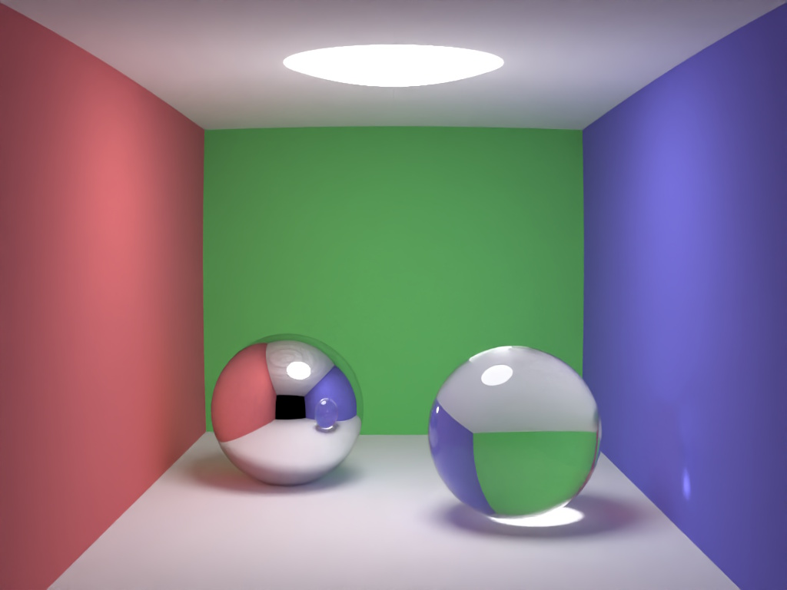

# UWAL | WebGPU Smallpt

_WebGPU port of **smallpt**: Global Illumination in 99 lines of C++ by [Kevin Beason](https://kevinbeason.com/)._

[](https://ustymukhman.github.io/uwal-webgpu-smallpt/dist/)

# Introduction

Original source code was found [here](https://www.kevinbeason.com/smallpt/) and ported to the web using TypeScript and WebGPU. Actually, this version is loosely based on two modifications of the original algorithm. The first one is called "explicit.cpp" which can be found [here](https://www.kevinbeason.com/smallpt/explicit.cpp) and, as its description specifies, is a

> Huge speedup, especially for small lights. Adds explicit light sampling with 23 additional lines of code and a small function signature change. Produces [this image](https://www.kevinbeason.com/smallpt/explicit16.png) in 10 seconds on a Intel Core i7 920 quad-core CPU using 16 samples per pixel.

The second one is called "[forward.cpp](https://www.kevinbeason.com/smallpt/forward.cpp)" and it's a

> Revision of `radiance()` function that removes all recursion and uses only a simple loop and no path branching. That is, the ray tree is always one ray wide.

Moreover, other than running on the GPU instead of the CPU like the original C++ implementation, this port also introduces some features on top of the original algorithm, those beeing:

- [UWAL](https://ustymukhman.github.io/uwal/) library for a more straight forward context initialization and to easily manage WebGPU resources.

- [OffscreenCanvas](https://developer.mozilla.org/en-US/docs/Web/API/OffscreenCanvas)_(es)_[^1] to avoid blocking the main thread while the simulation is running.

- [oidn-web](https://github.com/pissang/oidn-web) denoising library to produce a clearer output image after only a few samples.

[^1]: _At the moment, 2 canvas elements are used: one with the WebGPU context to run the path tracer (compute shader) and output the result (render pass); and one one with a 2D context to output the result of the image denoiser. I know that a better implementation would be to use only one canvas with a WebGPU context and run a denoiser on top of that, leveraging input and output buffers to avoid the cost of syncing between CPU and GPU as mentioned [here](https://github.com/pissang/oidn-web?tab=readme-ov-file#integrate-into-your-webgpu-pipeline), but that would require to setup an additional normal and albedo buffers since `hdr` and `aux` options are required in the WebGPU pipeline. This is considered to be a nice future improvement._

## Download

```bash
git clone https://github.com/UstymUkhman/uwal-webgpu-smallpt.git
cd uwal-webgpu-smallpt
```

## Develop

```bash
bun install
bun run dev
```

## Build

```bash
bun run build
bun run preview
```
